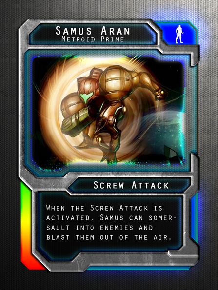
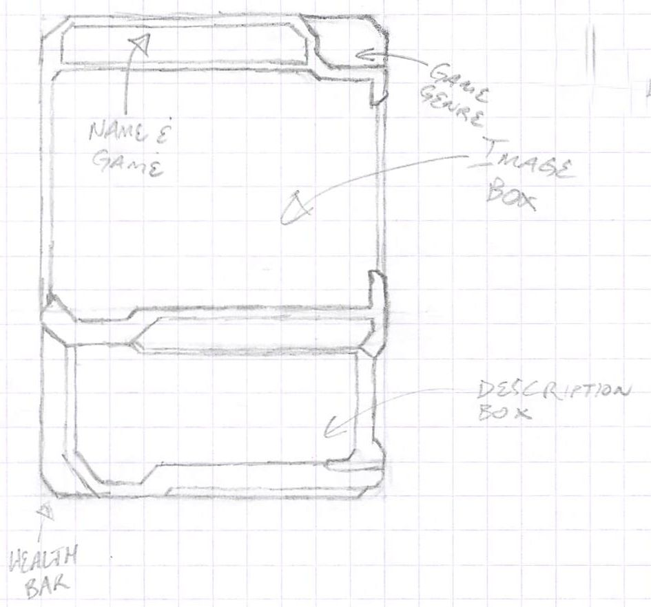

# Gatekeepers Card Creation Tool

> The Gatekeepers web app is currently in production. Once complete, a link will be put here. Until then, please follow development on [Trello](https://trello.com/b/EvQ4EWf4).

Gatekeepers is a [Collectible Card Game](https://en.wikipedia.org/wiki/Collectible_card_game) where all cards are created by the player. This web app is the card creating module of the game. The player enters the requested card information into a React powered form, and saves it to a database to be viewed, edited, and deleted at any time.

Each card follows a very specific template with customizable areas within it. The base template will not be editable, but will act as the frame around the custom user generated content.

Specifically, the purpose of this project is to demonstrate the flexibility and power of Facebook's React JavaScript library.

## Wireframes

## User Stories

1. As a user I want to be able to create a card using a form so that it's easy to make sure I've gotten all of the important bits
1. As a user I want to see all of the created cards displayed on screen so I know what's already been created
1. As a user I want to edit any created card in case I make a mistake
1. As a user I want to delete any cards I've created because not everything needs to be permanent
1. As a user I want to see the fields populate the card as I type it so I can visualize what it will look like once in play
1. As a user I want my cards to be saved across sessions so I don't have to keep creating the same cards over and over
